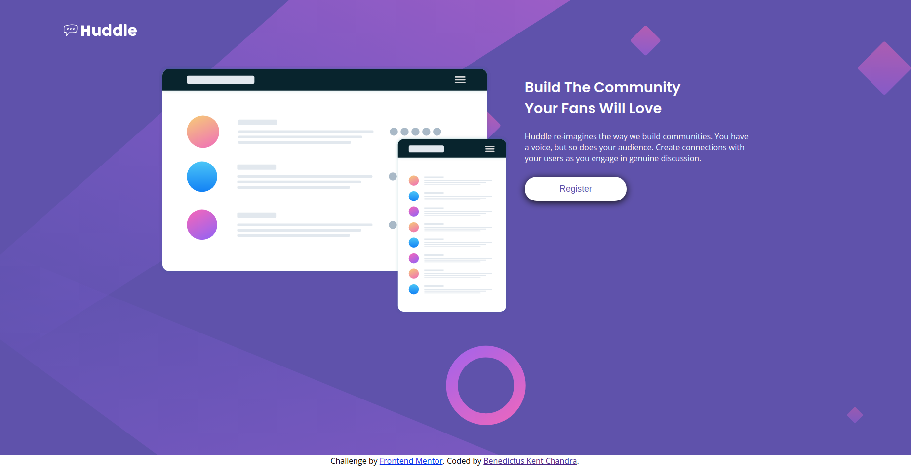

# Frontend Mentor - Huddle landing page with single introductory section solution

This is a solution to the [Huddle landing page with single introductory section challenge on Frontend Mentor](https://www.frontendmentor.io/challenges/huddle-landing-page-with-a-single-introductory-section-B_2Wvxgi0). Frontend Mentor challenges help you improve your coding skills by building realistic projects.

## Table of contents

-   [Overview](#overview)
    -   [The challenge](#the-challenge)
    -   [Screenshot](#screenshot)
    -   [Links](#links)
-   [My process](#my-process)
    -   [Built with](#built-with)
    -   [What I learned](#what-i-learned)
    -   [Continued development](#continued-development)
    -   [Useful resources](#useful-resources)
-   [Author](#author)
-   [Acknowledgments](#acknowledgments)

## Overview

### The challenge

Users should be able to:

-   View the optimal layout for the page depending on their device's screen size
-   See hover states for all interactive elements on the page

### Screenshot



### Links

Live Site URL: [Github Pages](https://benedictuskent.github.io/Huddle_LandingPage/)

## My process

### Built with

-   Semantic HTML5 markup
-   CSS custom properties
-   Flexbox
-   Mobile-first workflow

### What I learned

1. Learnt that websites need to start with formatting the site layout.
    - Spent a lot of time making one part of the layout "perfect" only to be deleted later
    - Start preparing for layout with HTML
2. Better to work on mobile-view first.
    - Worked on desktop-view first, but failed to make it responsive (Work can be found in `layout only` folder)
    - Changed perspective to mobile-view first and made it easier for responsive design (Learnt from [Kevin Powell](https://youtu.be/0ohtVzCSHqs) on YouTube)
3. `:root` on CSS is neat! I'm glad I found this!

```css
:root {
    --color-primary: hsl(257, 40%, 49%);
    --color-accent: hsl(300, 69%, 71%);
    --color-neutral: white;

    --ff-heading: "Poppins", sans-serif;
    --ff-body: "Open Sans", sans-serif;
}
```

### Continued development

The hardest part of this project is responsive design.  
In this project, the responsiveness of the page starts to break when shrank to ~900px.  
To avoid this, I purposefully made the page change to mobile layout at 1000px.

I will need to learn more responsive design in order to fix this issue.

### Useful resources

-   [Responsive design made easy](https://youtu.be/bn-DQCifeQQ) - This video helped me understand how to layout with HTML.
-   [Are you writing responsive CSS the wrong way?](https://youtu.be/0ohtVzCSHqs) - This video introduced me to mobile-first perspective which made my CSS cleaner and less complex.

## Author

-   Github - [Beneditus Kent](https://github.com/BenedictusKent)
-   Frontend Mentor - [@BenedictusKent](https://www.frontendmentor.io/profile/BenedictusKent)
-   Twitter - [@BenedictusKentt](https://twitter.com/BenedictusKentt)

## Acknowledgments

I wanna thank Kevin Powell for his easy-to-understand videos. Without it, I'll still be stuck on the desktop-fist perspective.
